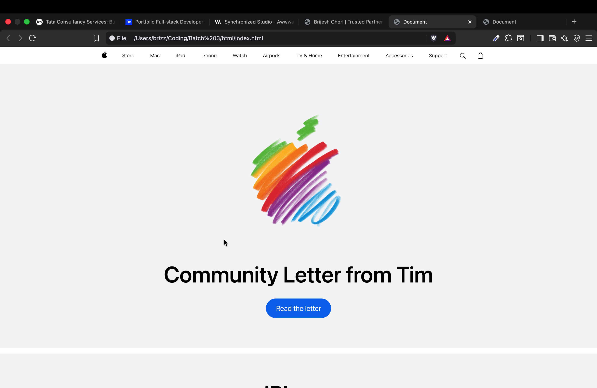
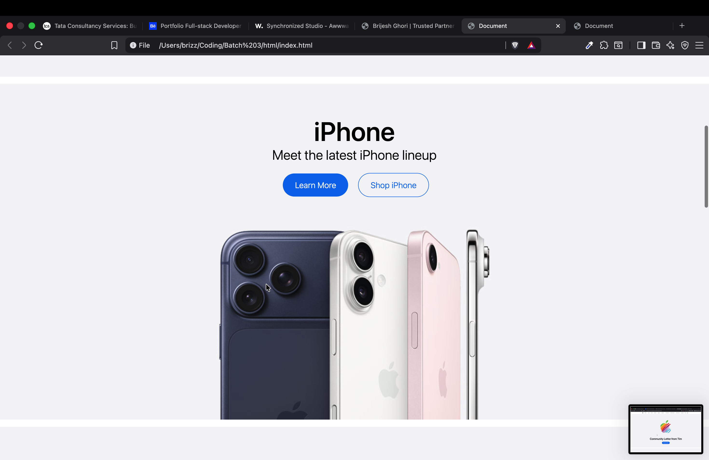

# Apple Homepage Clone (HTML + CSS Only)

A simple clone of Apple’s homepage built using only basic HTML and CSS.

## 🚀 Features
- Clean UI inspired by Apple.com
- Built without Flexbox or Grid
- Focus on margin, padding, and positioning

## 🧠 What I Learned
- Deep understanding of the CSS box model
- Layout structuring without modern tools
- Importance of spacing and alignment

## 📸 Screenshots

## 🛠 Tech Used
- HTML5
- CSS3

## 🎯 Future Improvements
- Rebuild using Flexbox
- Make it responsive
- Add animations

## 📌 Note
This is a practice project for learning purposes only. Not affiliated with Apple.
